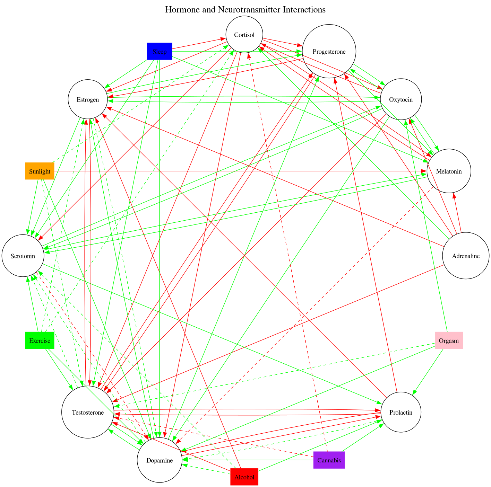

# Hormone Interactions

This is a rough attempt to map the effects of sleep, sunlight, exercise, sex,
cannabis, and alcohol on our hormonal and neurotransmitter levels. It also shows how
hormones and neurotransmitters affect each other.

